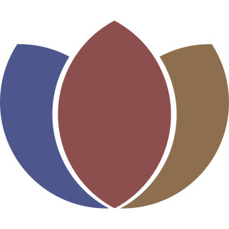
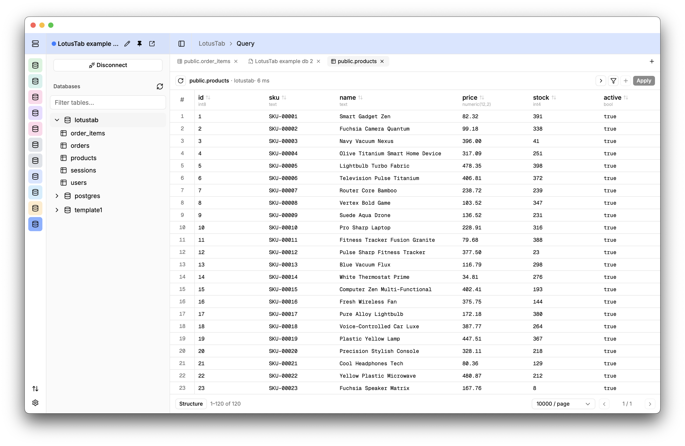

  

<h1 align="center">LotusTab</h1>

A desktop database client for **PostgreSQL**, **MySQL**, and **ClickHouse**. Open connections, browse tables, run SQL, and keep as many tabs as you need.

  <picture>
    <source media="(prefers-color-scheme: dark)" srcset="showcase/screenshots/table_view_d.png">
    
  </picture>

- Unlimited connections
- Unlimited tabs
- Unlimited filters

## Download

Install from the latest GitHub Release (preferred over building from source):

**[Download LotusTab](https://github.com/JhnBer/lotustab/releases/latest)**

| Platform | What to grab |
| --- | --- |
| macOS (Intel + Apple Silicon) | `lotustab-darwin-universal-*.zip` (or `.dmg`) |
| Windows (x64) | `lotustab-windows-amd64-*.exe` |
| Linux (x64) | `lotustab-linux-amd64-*.tar.gz` |

Checksums ship as `SHA256SUMS` on the same release. The in-app updater uses this channel; restart is always manual.

## What you get

- **Engines:** PostgreSQL, MySQL, and ClickHouse adapters
- **Keychain secrets:** passwords live in the OS keychain, not in profile JSON or logs
- **SSH tunnels:** connect through SSH, including an optional jump host
- **Unlimited tabs:** query tabs and table browse tabs side by side
- **One results grid:** table browse and SQL results share the same grid; large values open beside it

## License

LotusTab is licensed under the [GNU General Public License v3.0](LICENSE).

Contributions are accepted under MIT via the [CLA](CLA.md). See [CONTRIBUTING.md](CONTRIBUTING.md).

## Build

Build, the local PostgreSQL, and the seed are described in [docs/development.md](docs/development.md).

## Languages

If a translation key is missing, the UI uses English.

Request a language in a GitHub issue, or open a pull request that adds one. Instructions are in [docs/languages.md](docs/languages.md).
